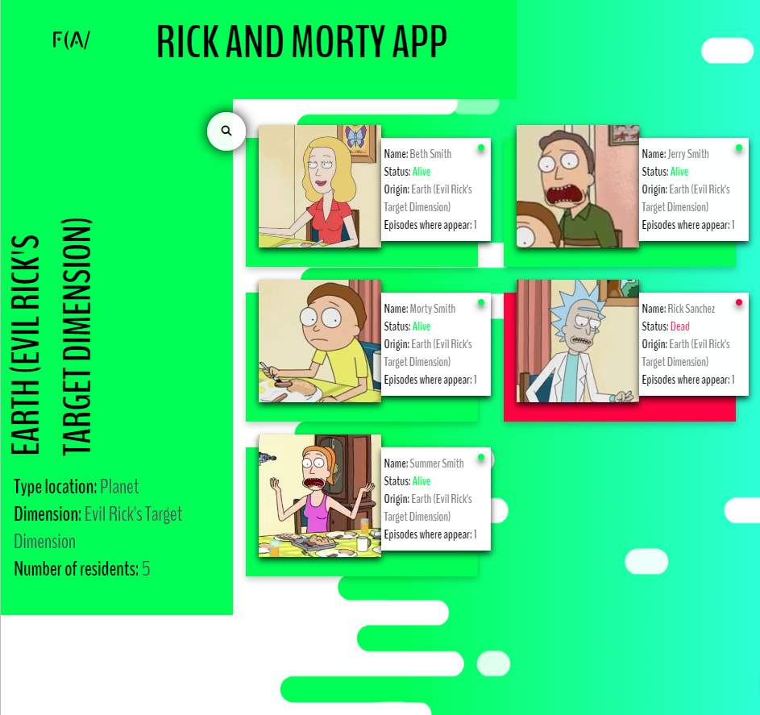

# Rick and Morty

Es un proyecto en el que se practica el despliegue o consumo de información de una API, en el **Front-End**, en este caso la API de _Rick and Morty_

Para esto se hace uso de **_React, React Hooks, CSS modules y Axios,_** con la finalidad de tener un proyecto con cierto nivel de dificultad y que además emplee algunas de las tecnologías más usadas en el desarrollo web.

[Proyecto desplegado en Netlify](https://flav-rickandmorty-app.netlify.app/)

Algunas carturas del proyecto

